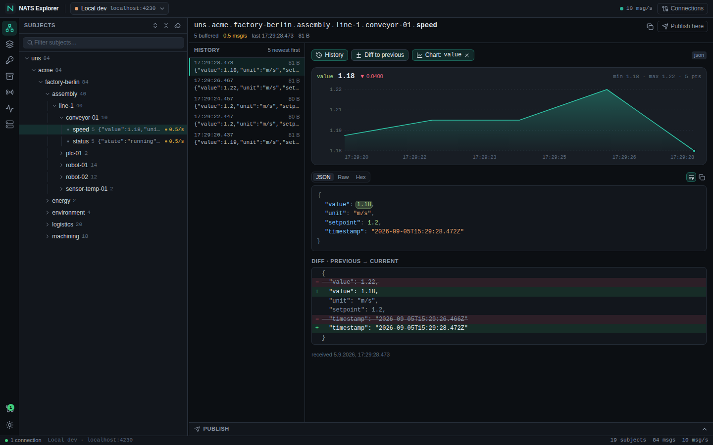
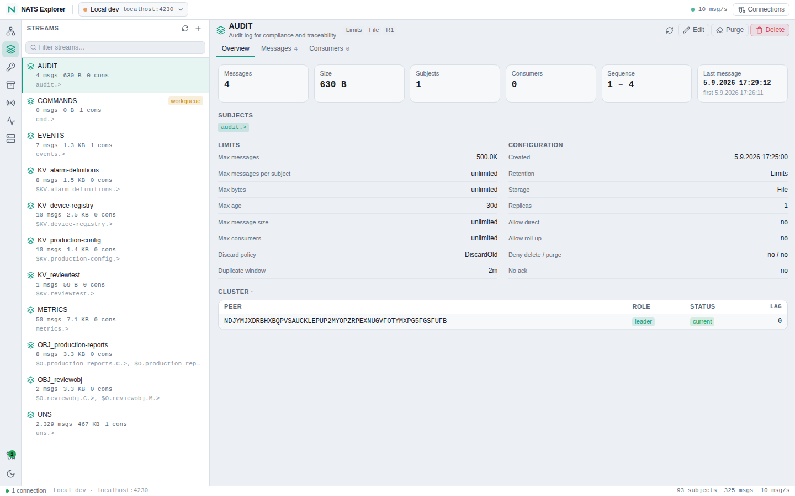
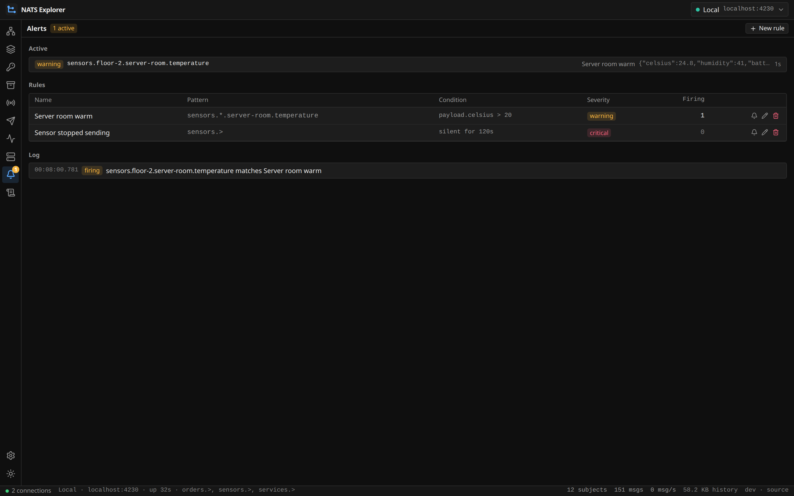
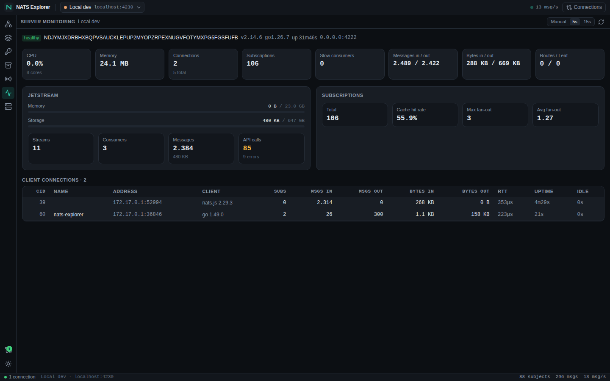
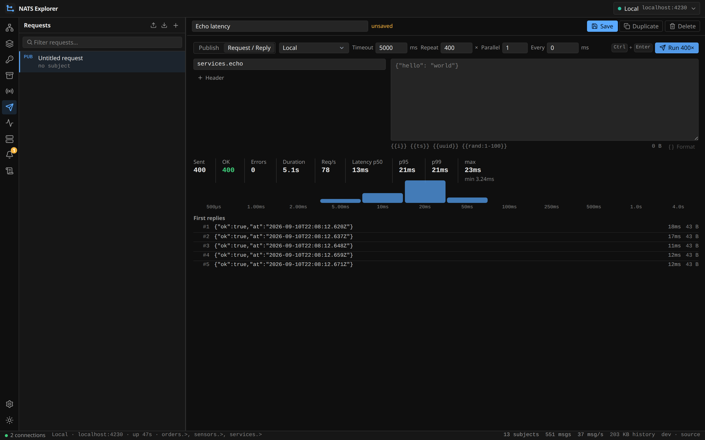
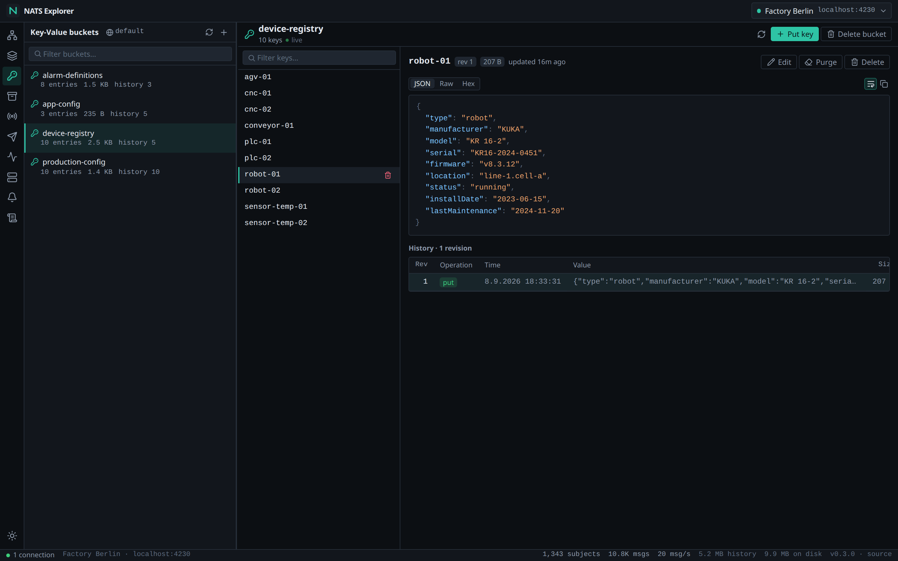
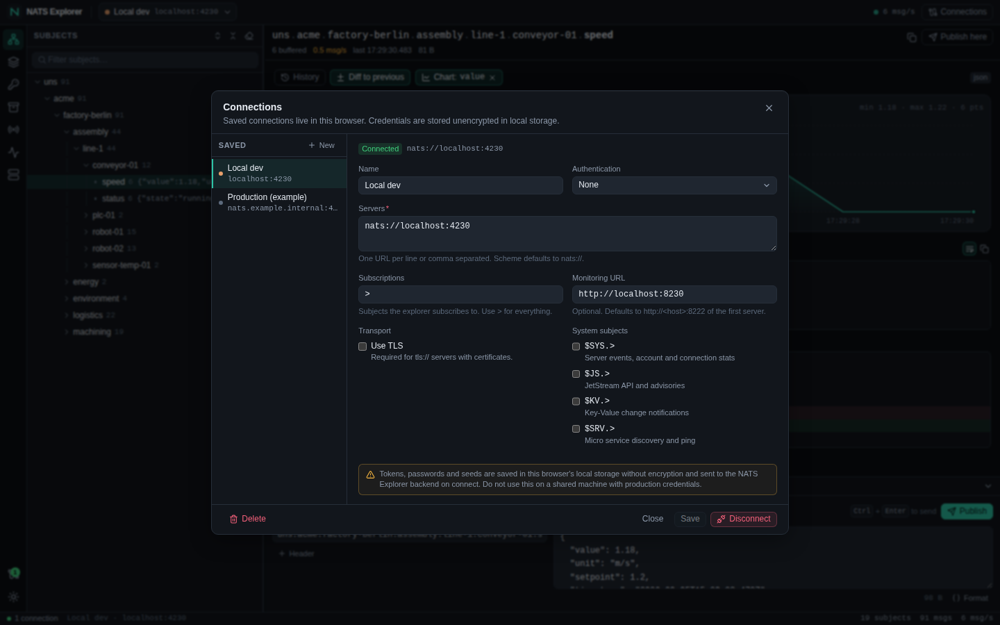

# NATS Explorer

A NATS management tool and message explorer inspired by MQTT Explorer, available as a desktop app for Windows, macOS and Linux and as a web UI served by a single Go binary or Docker image. Browse subjects as a live tree, manage JetStream streams, Key-Value and Object Stores, run and repeat requests, and watch servers, clusters and leaf nodes -- with dark and light themes.

Documentation: **[blanpa.github.io/nats-explorer](https://blanpa.github.io/nats-explorer/)** --
[installation](https://blanpa.github.io/nats-explorer/installation.html),
[features](https://blanpa.github.io/nats-explorer/features.html),
[deployment](https://blanpa.github.io/nats-explorer/deployment.html),
[architecture and API](https://blanpa.github.io/nats-explorer/architecture.html).
See the [changelog](CHANGELOG.md) for what changed in each release.



<details>
<summary>More screenshots</summary>








</details>

[](https://blanpa.github.io/nats-explorer/)
[](LICENSE)


[](https://github.com/sponsors/blanpa)

---

## Download

The links below always resolve to the newest release. The [Releases page](https://github.com/blanpa/nats-explorer/releases) has the same files with the version in their name, the release notes and every older build.

### Desktop app

| Platform | Download | Notes |
|---|---|---|
| Windows 10/11 | [Installer (.exe)](https://github.com/blanpa/nats-explorer/releases/latest/download/nats-explorer-desktop-windows-x64-setup.exe) · [portable (.zip)](https://github.com/blanpa/nats-explorer/releases/latest/download/nats-explorer-desktop-windows-x64.zip) | Per-user installer, no admin rights needed; creates Start-menu entry and uninstaller. Uses the Edge WebView2 runtime (present on Windows 11; downloaded on first start otherwise). The installer is not code-signed: SmartScreen shows "unknown publisher", choose *More info → Run anyway*. |
| macOS 11+ (Intel and Apple Silicon) | [Disk image (.dmg)](https://github.com/blanpa/nats-explorer/releases/latest/download/nats-explorer-desktop-macos-universal.dmg) · [app bundle (.zip)](https://github.com/blanpa/nats-explorer/releases/latest/download/nats-explorer-desktop-macos-universal.zip) | Universal build. Drag *NATS Explorer* to *Applications*. The app is not notarized: on first start right-click → *Open*, or run `xattr -dr com.apple.quarantine "/Applications/NATS Explorer.app"`. |
| Linux x64 | [AppImage](https://github.com/blanpa/nats-explorer/releases/latest/download/nats-explorer-desktop-linux-x64.AppImage) · [.deb](https://github.com/blanpa/nats-explorer/releases/latest/download/nats-explorer-desktop-linux-x64.deb) · [.tar.gz](https://github.com/blanpa/nats-explorer/releases/latest/download/nats-explorer-desktop-linux-x64.tar.gz) | AppImage: `chmod +x` and run. Debian/Ubuntu: `sudo apt install ./nats-explorer-desktop-linux-x64.deb` (pulls `libwebkit2gtk-4.1-0`). |

### Server and Docker

The server is one binary that serves the web UI on http://localhost:3002. Env: `PORT`, `PUBLIC_PATH`, `AUTH_TOKEN`, `HISTORY_MB`; the full list is in the [installation guide](docs/installation.md).

| Target | Download |
|---|---|
| Linux x64 | [nats-explorer-server-linux-x64.tar.gz](https://github.com/blanpa/nats-explorer/releases/latest/download/nats-explorer-server-linux-x64.tar.gz) |
| Linux arm64 | [nats-explorer-server-linux-arm64.tar.gz](https://github.com/blanpa/nats-explorer/releases/latest/download/nats-explorer-server-linux-arm64.tar.gz) |
| macOS arm64 (Apple Silicon) | [nats-explorer-server-macos-arm64.tar.gz](https://github.com/blanpa/nats-explorer/releases/latest/download/nats-explorer-server-macos-arm64.tar.gz) |
| macOS x64 (Intel) | [nats-explorer-server-macos-x64.tar.gz](https://github.com/blanpa/nats-explorer/releases/latest/download/nats-explorer-server-macos-x64.tar.gz) |
| Windows x64 | [nats-explorer-server-windows-x64.zip](https://github.com/blanpa/nats-explorer/releases/latest/download/nats-explorer-server-windows-x64.zip) |
| Docker | `docker run -p 3002:3002 ghcr.io/blanpa/nats-explorer:latest` ([all tags](https://github.com/blanpa/nats-explorer/pkgs/container/nats-explorer)) |

Checksums for every file: [SHA256SUMS.txt](https://github.com/blanpa/nats-explorer/releases/latest/download/SHA256SUMS.txt).

The desktop app is the same Go backend plus the UI in a native window (Wails, system webview). Connections, request templates and preferences are stored in `settings.json` under the OS config directory (`~/.config/nats-explorer`, `%AppData%\nats-explorer`, `~/Library/Application Support/nats-explorer`); credentials go to the system keyring (Secret Service, Keychain, Credential Manager) or, where none is available, to a `secrets.json` readable only by your user. Back up that directory to keep your setup. The same file storage can be enabled for a personal server with `STORAGE_DIR=/path` (`NO_KEYRING=1` forces the file fallback).

### Building the installers yourself

```bash
bun install && bun run --filter shared build && bun run --filter client build
scripts/build-desktop.sh --docker linux     # AppImage, .deb, tar.gz  (uses scripts/desktop-builder.Dockerfile)
scripts/build-desktop.sh --docker windows   # NSIS installer + portable zip, cross-compiled
scripts/build-desktop.sh macos              # on a Mac: universal .app + .dmg (needs the Wails CLI)
scripts/smoke-desktop.sh go-server/build/bin/nats-explorer   # launches the build headless and checks API, UI and websocket
```

Releases are produced by `.github/workflows/release.yml` on every `v*` tag: the UI is built once, each OS job builds and smoke-tests its package (silent install/uninstall on Windows), and everything is attached to the GitHub release with a `SHA256SUMS.txt`.

## Features

- **Subject Tree** -- Virtualized live tree of dot-separated subjects with inline values, rates, keyboard navigation and filtering
- **Message Detail** -- JSON/raw/hex views, history, diff to the previous message, charts for numeric fields
- **JetStream** -- Create, edit, purge and delete streams; page through messages from the newest sequence; live tail; manage consumers
- **Key-Value** -- Browse buckets, edit keys, purge, full revision history, live updates via server-side watch
- **Object Store** -- Drag & drop upload, download, delete objects and stores
- **Services** -- Discover NATS micro services ($SRV.INFO / STATS / PING)
- **Publish / Request-Reply** -- Send messages with headers, perform request-reply with timeout
- **Multi-Connection** -- Connect to multiple NATS servers simultaneously
- **Authentication** -- Token, username/password, NKey, JWT/credentials, TLS
- **Live Value Charts** -- Chart any numeric JSON field over time as line, area, step, bars or dots
- **JetStream domains** -- a connection can target a JetStream domain or API prefix (leaf nodes behind a hub and vice versa), and the JetStream, KV and Object Store panes can switch domains ad hoc
- **Requests module** -- Postman-style request templates in the sidebar: create, edit, duplicate, run, import/export as JSON. Repeat a request up to 10 000× with parallel senders and `{{i}}`/`{{ts}}`/`{{uuid}}`/`{{rand:1-100}}` variables and read throughput and latency percentiles. The publish drawer under a subject uses the same templates
- **TLS with certificates** -- CA certificate, client certificate and key can be pasted or loaded from files per connection (mutual TLS), plus an insecure mode for test setups
- **Cluster module** -- every node of the cluster with version, uptime, CPU, memory, connections and JetStream usage, the JetStream meta cluster (leader, peers, lag, offline) and the placement of every stream with its leader and replicas. Needs system-account (`$SYS`) credentials on the connection; without them the module shows the connected node only
- **Monitoring with history** -- messages/s and bytes/s in and out, connections, subscriptions, CPU and JetStream API rates over time, cluster routes and leaf nodes with their traffic
- **Payload filter** -- A [CEL](https://cel.dev/) expression such as `payload.temp > 80` keeps only the subjects whose last message matches, and narrows the message list, the search, time ranges and charts with it
- **Derived schema** -- The fields of a subject's JSON payloads with types, presence, ranges and examples, read from the recorded messages, with a marker when newer messages drift from older ones
- **Alerts** -- Rules watch a subject pattern for an expression that holds or for a subject that fell silent, with severities, an optional webhook and a dry run against the recorded messages; they run in the backend, so they keep working with no browser open
- **Persistent history** -- `HISTORY_DB` keeps a SQLite copy of every message with retention; a range picker (15 min to 7 days) shows any period in the same view as the live feed
- **Search** -- Over one subject and everything below it, or across every subject, answered by a full-text index when a persistent history is configured
- **Long-range charts** -- Minute aggregates behind the scenes, so a week of data is a few hundred points
- **Bookmarks** -- Keep a subject with a name, group and note, and get back to it even when it is filtered out
- **Support bundle** -- Export a time range plus the server snapshot as one zip and open it again in any explorer as a read-only connection
- **Payload decoders** -- MessagePack, Protocol Buffers and Avro decoded into the JSON tree, per subject pattern
- **Accounts and roles** -- `AUTH_TOKEN` or a users file with `admin` and `viewer`; sessions are HttpOnly cookies, and every write is recorded in an audit log
- **Prometheus endpoint** -- `/metrics` with the explorer's own counters
- **Themes** -- Dark and light, follows the OS preference on first start

---

## Quick Start

### Docker (recommended)

```bash
docker compose up -d
```

Starts NATS (port 4222) and NATS Explorer (port 3002). Open `http://localhost:3002`.

### Standalone Binary

Take a server archive from the [download table](#server-and-docker); the UI is bundled as `public/` next to the binary and found automatically:

```bash
# Linux / macOS (swap linux-x64 for your platform)
curl -fL -o nats-explorer-server.tar.gz \
  https://github.com/blanpa/nats-explorer/releases/latest/download/nats-explorer-server-linux-x64.tar.gz
mkdir -p nats-explorer && tar xzf nats-explorer-server.tar.gz -C nats-explorer --strip-components=1
cd nats-explorer && ./nats-explorer

# Windows: extract nats-explorer-server-windows-x64.zip, then run nats-explorer.exe
```

Open `http://localhost:3002` and configure your NATS server in the connection dialog. `STORAGE_DIR=/path` keeps connections and templates on the server instead of in the browser (single-user setups).

### Docker (standalone, no NATS included)

Runs the released image against your own NATS server, with the message history on a volume:

```bash
docker compose -f docker-compose.standalone.yml up -d
```

---

## Development

### Prerequisites

- **Go** 1.24+
- **Bun** 1.2+ (package manager and script runner; Node.js is not required)
- **Docker** (for the dev NATS server)

### Setup

```bash
bun install

# Start dev NATS server with sample data
bun run nats:dev

# Start Go backend + Vite frontend (hot reload)
bun run dev
```

The Go server runs on `http://localhost:3002`, the Vite dev server on `http://localhost:5173`.

### Tests

```bash
bun run --filter client test       # vitest unit tests
cd go-server && go test -race ./... # Go unit + end-to-end tests (embedded nats-server)
bun run nats:dev                   # dev NATS on :4230 with seed data, then:
cd e2e && bunx playwright install chromium && cd ..
bun run test:e2e                   # Playwright smoke suite against http://localhost:3002
```

The e2e suite honours `NE_URL`, `NATS_URL`, `NATS_MON_URL` and `PW_CHROME=/path/to/chrome`.

---

## Tech Stack

| Layer   | Technology                                                   |
| ------- | ------------------------------------------------------------ |
| Backend | Go 1.26, chi router, gorilla/websocket, nats.go             |
| Client  | React 19, TypeScript, Vite 8, Tailwind 4, Zustand, Radix UI, Bun, Biome |
| Shared  | TypeScript types (workspace package)                         |
| Build   | Docker multi-stage, Go cross-compilation                     |
| Deploy  | Docker, standalone binaries (no runtime dependencies)        |

---

## Architecture

```
                        +-------------------+
                        |   NATS Server(s)  |
                        |   (port 4222)     |
                        +--------+----------+
                                 | TCP (nats.go)
                                 |
+------------------+    +--------+----------+
|   Browser        | WS |   Go Server       |
|   (React SPA)    +----+   (port 3002)     |
|                  |HTTP|                   |
|   - Subject Tree +----+ - Connection Store|
|   - JetStream    |    | - Subscription Mgr|
|   - KV / ObjStore|    | - Subject Tree    |
|   - Monitoring   |    | - chi Router      |
|   - Services     |    | - WebSocket Hub   |
+------------------+    +-------------------+
```

---

## Building

### Desktop installers

See [Building the installers yourself](#building-the-installers-yourself) above (`scripts/build-desktop.sh`).

### Server binaries

```bash
scripts/build-server.sh              # all five platforms into dist/server/ (what the release ships)
scripts/build-server.sh linux/arm64  # one platform
bun run build                        # this machine only: dist/nats-explorer serving client/dist
```

### Docker image

```bash
docker build -f go-server/Dockerfile -t nats-explorer .
```

## Security

Without `AUTH_TOKEN` or `AUTH_USERS` the backend has no authentication: bind the port to localhost or a trusted network only. With either of them every API and websocket request needs a session, obtained once through the login and kept in an HttpOnly cookie; `AUTH_USERS` adds the roles `admin` and `viewer`, where a viewer cannot publish or change anything. Every write is recorded in the audit log, which only an admin may read.

NATS credentials are held in memory. Saved connections, including tokens and passwords, live unencrypted in the browser's local storage unless `STORAGE_DIR` is set; then they go to a settings file on the server and the credentials to the system keyring, or to a `secrets.json` readable only by the user running the process.

See [docs/review-2026-09.md](docs/review-2026-09.md) for the findings of the September 2026 code review and redesign.

---

## Configuration

| Variable      | Default | Description                      |
| ------------- | ------- | -------------------------------- |
| `PORT`        | `3002`  | HTTP server port                 |
| `PUBLIC_PATH` | --      | Path to client static files      |
| `AUTH_TOKEN`  | --      | When set, every API and websocket request needs the token (`Authorization: Bearer`, `X-Auth-Token` or `?token=`); the UI asks for it once and keeps a session cookie. |
| `AUTH_USERS`  | --      | Users file (`name:role:bcrypt-hash`, roles `admin` / `viewer`); the UI shows a login, viewers are read-only. `nats-explorer hash-password` prints a hash. |
| `HISTORY_MB`  | `256`   | Memory budget for the recorded message history the UI pulls from |
| `HISTORY_DB`  | --      | SQLite file for a persistent copy of the history; `HISTORY_RETENTION` (default `72h`) bounds it |
| `ROLLUP_RETENTION` | `2160h` | With `HISTORY_DB`: how long the minute aggregates behind long-range charts are kept |
| `STORAGE_DIR` | --      | Keep connections, templates and preferences on the server instead of the browser; `NO_KEYRING=1` forces the `secrets.json` fallback |
| `PPROF`       | --      | When set, Go's profiler is served under `/debug/pprof` |
| `SOURCE_URL`  | this project | Where the source of this build is offered; the UI links it as "source". Set it when you deploy a modified version ([AGPL](https://blanpa.github.io/nats-explorer/license.html)) |

---

## Project Structure

```
nats-explorer/
  go-server/                  # Go backend
    main.go                   # Server entry point (desktop.go: Wails window, build tag `desktop`)
    server.go                 # Router wiring
    build/                    # Desktop packaging assets (icon, Info.plist, NSIS script, desktop entry)
    internal/
      connection/store.go     # Multi-connection NATS store (main + system-account connections)
      handler/                # HTTP handlers (one per feature: streams, kv, run, cluster, settings …)
      settings/               # File-backed UI settings + keyring secrets
      subscription/           # Message subscription, budgets & subject tree feed
      ws/hub.go               # WebSocket connection hub
  client/                     # React frontend (Vite)
    src/
      components/             # Feature-organized UI components (subjects, jetstream, kv, objectstore, services, requests, monitoring, cluster)
      lib/                    # API client, WebSocket, storage sync, utilities
      store/                  # Zustand state management
  shared/                     # Shared TypeScript type definitions
  e2e/                        # Playwright smoke suite
  scripts/                    # Desktop build, builder image, smoke tests
  dev/                        # Dev NATS server and simulators
  docs/                       # The published documentation site (GitHub Pages), screenshots
  .github/workflows/          # CI + Release pipelines
```

---

## Release Targets

Releases are built automatically on tag push (`v*`); a manual `workflow_dispatch` run produces the same artifacts without publishing.

| Target | Files |
| --- | --- |
| Windows desktop | `…-windows-x64-setup.exe` (per-user installer), `…-windows-x64.zip` (portable) |
| macOS desktop | `…-macos-universal.dmg`, `.zip` (Intel + Apple Silicon) |
| Linux desktop | `…-linux-x64.AppImage`, `.deb`, `.tar.gz` |
| Server (headless) | `nats-explorer-server-<version>-{linux-x64,linux-arm64,windows-x64,macos-x64,macos-arm64}` |
| Docker (GHCR) | `ghcr.io/blanpa/nats-explorer:<version>` |

Every release carries a `SHA256SUMS.txt`. Installers are not code-signed (see the notes in [Install](#install)).

---

## Sponsor this project

This project is developed and maintained in my own time.
If it saves you some, consider supporting it:

<a href="https://github.com/sponsors/blanpa">
  
</a>
<a href="https://buymeacoffee.com/blanpa">
  
</a>

## License

[GNU Affero General Public License v3.0 or later](LICENSE) -- Copyright 2026 blanpa

Free to use, self-host and modify. If you distribute a modified version, or offer
it to others over a network, the users of that version have to be able to get its
source under the same license.

The name "NATS Explorer" and the project's marks are not covered by the license.
A modified version has to carry a different name and may not imply endorsement by
this project. For a use these terms do not fit, ask about a commercial license.
