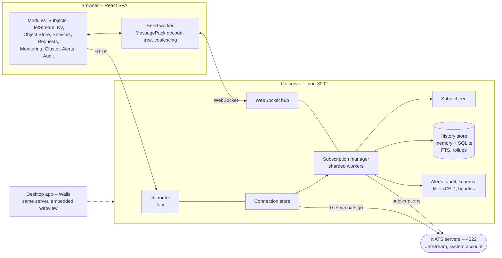

# Architecture

NATS Explorer is a client-server application with a Go backend and React frontend, communicating via REST and WebSocket.

<details open markdown="block">
  <summary class="text-delta">Contents</summary>
1. TOC
{:toc}
</details>

---

## Overview



The desktop app and the web deployment run the same Go server and the same
frontend bundle; the difference is where settings and credentials live
([below](#desktop-app)) and who may reach the port.

---

## Go Backend

The backend is built with [chi](https://github.com/go-chi/chi) and [nats.go](https://github.com/nats-io/nats.go).

### Server lifetime (`server.go`, `features.go`)

`createServer` wires the router and returns an `appServer`: the handler plus a `Close` that stops everything it started -- the shard workers of every connection, the NATS connections themselves, the hooks features registered with `d.onShutdown`, and the persistent history. The binary closes it on `SIGINT`/`SIGTERM` after draining the listener, the desktop app when its window is gone, and the tests through `newTestServer`. Optional parts of the server register themselves in `features.go` with `registerFeature`; a feature sees the shared `deps` and can attach to the record hook, the API router or the shutdown.

### Connection Store (`internal/connection/store.go`)

Manages multiple simultaneous NATS connections. Each connection gets:
- A unique ID and display name
- A color for visual distinction in the UI
- Thread-safe access via `sync.RWMutex`

### Handlers (`internal/handler/`)

One handler struct per feature domain, each receiving a pointer to the connection store:

| Handler              | Endpoints                                     |
|:-------------------- |:--------------------------------------------- |
| `ConnectionHandler`  | connect, disconnect, list, status, cluster     |
| `PublishHandler`     | publish, request-reply                         |
| `StreamsHandler`     | stream CRUD, message browsing, purge           |
| `ConsumersHandler`   | consumer CRUD per stream                       |
| `KVHandler`          | bucket CRUD, key CRUD, history                 |
| `ObjectStoreHandler` | store CRUD, object upload/download/delete      |
| `MonitoringHandler`  | proxy to NATS monitoring HTTP API              |
| `ServicesHandler`    | service discovery ($SRV.*)                     |
| `HistoryHandler`     | recorded history: subject, branch, range, search, series |

### Support bundle (`feature_bundle.go`)

Export streams a zip straight to the response: manifest, `messages.jsonl` oldest first, and the snapshots. Import builds a `subscription.Manager` that runs without a NATS subscription (`StartOffline`) and pushes the recorded messages through the same shard path as live traffic (`Ingest`), so the subject tree, the counters and the history end up as they were. The connection itself is a `connection.Status` registered with `Store.AddVirtual`: listed like any other, `Bundle: true`, and `GetNC` refuses it, which is what stops every write path at once.

### Full text and rollups (`internal/history/fts.go`, `rollup.go`)

An external-content FTS5 table over `messages` with insert and delete triggers, created on open and filled once for a database written before it existed (tracked in `PRAGMA user_version`). The search turns each word into a quoted phrase joined by AND, keeps a trailing `*` as a prefix, and falls back to a LIKE scan when the index cannot express the query or comes back empty. The same writer transaction folds the numeric fields of JSON payloads into `rollups` (min, max, sum, count per connection, subject, field and minute); `Series` uses them for ranges over six hours.

### Audit (`internal/audit/`)

A middleware on the `/api` group between the authentication and the role check, so a refused write is recorded as well. It peeks at the first 8 KB of the body for the summary and passes the body on untouched. `FileStore` appends JSON lines next to the settings, `MemStore` keeps the last 5000 entries. Features register such middleware through `feature.apiMiddleware`, which runs before any route is registered because chi requires that.

### Alerts (`internal/alerts/`)

Rules are evaluated on the record hook of every subscription manager, throttled to one evaluation per second and subject, with the per-subject state in a sharded map so the hot path stays lock-light. A checker goroutine marks subjects silent that have not been seen for the rule's `staleAfter`. State changes go to the `alerts` websocket event (coalesced) and to the optional webhook. Rules live in the settings under `ne.alerts.v1`.

### Schema inference (`internal/schema/`)

`Infer` walks the recorded messages of a subject and reports fields with their types, presence, ranges, enumerations and examples, plus drift between the older and the newer half of the samples. Served by `GET /api/schema`, computed on request, never stored.

### Changing subscriptions (`internal/subscription/resubscribe.go`)

`SetSubjects` swaps the NATS subscriptions of a running manager instead of restarting it: patterns that stay keep their `patternStat`, and `forgetUnmatched` drops exactly the subjects no pattern covers, from the shards, the tree and the in-memory history. Removing a subject also removes it from the shards' pending change list, otherwise the next tree sync looks up a subject that is gone. Every tab's view is marked dirty so the difference, including the removals, reaches the browser.

### Payload filter (`internal/filter/`)

CEL expressions compiled once and cached by their text, evaluated against a `message.Record` or a wire message. Used by the tree view (`clientView.prg`, the `expr` field of the `view` websocket command) and by the history endpoints (`expr` query parameter). A subject stays in the tree while its last message satisfies the expression; the history endpoints scan more messages than the limit and cut back after filtering.

Two of the variables are not properties of the message: `valid` and `violations` say how it compares to the schema pinned for its subject. They are resolved through a custom CEL activation, so an expression that does not mention them never runs the check, and the pinned schemas stay behind one process-wide seam (`filter.SetSchemaChecker`, installed by the schemas feature) instead of being threaded through every caller. That is what makes `!valid` work in the tree, in a history query, in a time range and as an alert rule at once -- none of those know what a schema is.

### Auth (`internal/auth/`)

`auth.Service` identifies a request from the session cookie, a bearer token (`AUTH_TOKEN`) or HTTP basic auth against the users file (`AUTH_USERS`, `name:role:bcrypt`). `Require` answers 401 without an identity, `AdminForWrites` answers 403 for every method but GET and HEAD unless the role is `admin`. `POST /api/login` sets the HttpOnly cookie, `POST /api/logout` revokes the session, `GET /api/auth` tells the UI the mode and who it is. Without either variable every request is an admin. Sessions are in memory.

### Subscription Manager (`internal/subscription/`)

Manages real-time message subscriptions per connection:

- **Message handling** -- receives all messages matching subscribed subjects, counts them per subject and records every one in the history store (below)
- **Pull, not push** -- a browser tab only receives the messages of the subject (or branch) it looks at, reported with the `focus` websocket command. Everything else waits in the history and is fetched over `GET /api/history` when selected. So socket traffic and browser memory scale with what is on screen, not with the size of the subject space.
- **Feed budgets** -- per tab at most 50 msg/s per subject and 2000 msg/s in total; within the total the first message of a subject per second wins over repeats, so a wide branch keeps every subject fresh. Messages over budget are counted as `throttled`; the history still has them.
- **Server-side tree** -- the manager keeps the hierarchy as nodes with subtree aggregates (count, rate, child count), marked dirty along the path of every message and refreshed once per tick (0.5 s, backing off to 2 s for very large trees).
- **Viewport-driven tree feed** -- a tab sends its `view` (expanded branches, or "everything" with collapsed exceptions, or a filter) and receives only the nodes that view shows: roots plus the children of expanded branches, or the paths of every filter match. Per tab the server remembers what it sent and emits deltas: changed visible nodes each tick, and on a view change exactly the nodes that appeared or left (`removed`). Collapsing a branch of 100 000 subjects therefore costs nothing after the removal, and a filter is evaluated over the whole namespace on the server. Entries carry the subtree's subject count, so a collapsed branch says how much is under it, and a 100-char payload preview -- but only for a tab that shows previews (`noPreview` on the `view` command); the payload is the largest part of an entry, so a tree of counts and rates costs a fraction. Switching it changes the shape of what was already sent, so the tab's view is resent in full. Frames are permessage-deflate compressed.
- **Batching** -- feed messages are collected for 100 ms before sending; counters (`stats`) go out once a second
- **Sequence numbers** -- every message carries its arrival number on the connection so the browser can merge feed and history without duplicates

### History Store (`internal/history/`)

Keeps the recent messages of every connection and subject so the browser can ask for them instead of buffering everything itself:

- In memory, bounded by a byte budget (`HISTORY_MB`, default 256) shared by all connections and by 1000 messages per subject. Eviction is oldest-first across all subjects in O(1) per message: one arrival-ordered FIFO enforces the budget, and because each subject's FIFO is in the same order, the oldest live message is always the head of its subject.
- Answers two queries: the messages of one subject (oldest first, pageable backwards by sequence) and the newest messages below a branch (a k-way merge over the subjects' FIFOs). The UI pages with that cursor as the rail is scrolled, and the answer's `more` says whether the store still had messages before it -- a count would be wrong as soon as a payload filter empties a page. The persistent copy pages the same way with a `(timestamp, sequence)` cursor, so messages sharing a millisecond are not skipped. Sequences count per connection, so a view over several connections keeps one cursor per connection and merges the pages.
- `GET /api/history/range` answers `count=1` with the range's total beside the page (`DB.CountRange`). It is a covering-index scan -- no row is fetched, no payload touched -- and takes about 0.45 s over 3 000 000 rows, so it is asked for once with the first page rather than on every page. The client then pages the rest in on its own up to 50 000 messages, which cost about 42 MB of browser heap at 33 000 in a measured session.
- `GET /api/history/series` extracts a numeric JSON field over a subject's recorded history and reduces it to a few hundred buckets, so a chart over 10 000 messages costs a few hundred points on the wire. `agg=` picks the reduction (`internal/handler/aggregate.go`): min/max keeps both extremes of a bucket and is the default because it is the only one that never hides an outlier; avg, min, max, sum and count reduce to one point; rate differences the last value of each bucket and divides by the seconds between them, which is what a monotonic counter needs. Rate is taken after bucketing rather than inside a bucket, so the answer is per second whatever the number of buckets asked for, and a decrease reads as zero so a counter reset is not one enormous negative spike. The same reduction is applied to the minute rollups over long ranges, from the stored min/max/sum/count, so a chart does not change meaning when the range grows past six hours.
- A `Tee` keeps the memory store as the live source and copies every record to SQLite (`internal/history/sqlite.go`): asynchronous, batched inserts of up to 2 000 rows per transaction, and a queue bounded by memory (`HISTORY_QUEUE_BYTES`, 64 MB by default, not a number of messages) that drops rather than blocks when the writer falls behind, counted in the stats and shown in the status bar with what to change about it. Blocking is the wrong trade: it would stall the live feed and the tree for every tab because a disk cannot keep up, while a dropped copy is counted and shown. Retention by age runs once a minute. Time ranges, ranged search and ranged series read from it (`from`/`to` on `/api/history/range`, `/search`, `/series`).
- With a database, a connection restores its subject tree from it when it starts (`internal/subscription/restore.go`): the recorded subjects and their counts are seeded into the tree and the per-subject counters before the subscriptions exist, so nothing else is touching them yet. Only subjects the current patterns cover come back -- the database outlives what a connection listens to -- and at most 50 000 of them, largest first, with a five-second budget so a slow query cannot hold up a connect. The newest message of each subject comes back with the count -- whole, not as a preview, because the payload filter evaluates CEL against it and a truncated document would answer differently; payloads over 4 KB are restored as a count only. The rate is not restored: it describes the live connection and nothing else.
- What reaches the disk can be narrowed by a CEL expression (`HISTORY_FILTER` or the setting), evaluated in the tee before the queue rather than in the writer: what it excludes never takes up queue budget, so a burst of uninteresting subjects cannot push out the subjects being kept. The memory store is never filtered -- the live feed and the tree describe what actually arrived -- and what the filter leaves out is counted apart from what was dropped, because one is a choice and the other a loss. It is the only setting that lowers the write rate itself instead of making the writer faster, which makes it the largest of the three by far. The variables are resolved lazily, so a filter over the subject costs about 250 ns per message where parsing every payload up front cost 3.1 µs.
- The full-text index is what most of the write cost goes into: an `AFTER INSERT` trigger tokenises the subject and the whole payload of every message. It can be switched off (`HISTORY_FTS=0` or the setting), which multiplies the writer's throughput and sends searches down the LIKE-scan path that was already the fallback for queries FTS5 cannot express. Off, the index is emptied rather than left half-filled -- a partial index would answer a search with a subset and call it the result.
- The database behind the tee is a setting, not only an environment variable (`internal/history/persistence.go`): it sits behind an atomic pointer, so `PUT /api/history/persistence` opens or closes it while the server runs and the hot path reads it without a lock. The choice is stored with the other settings and applied at the next start. The desktop app defaults to on -- a restart would else empty everything it recorded -- a `STORAGE_DIR` server to off, and `HISTORY_DB` pins the setting as managed.
- `messages_ts` stays even though dropping it would buy about 9 % of the write rate. Measured on 2 000 000 rows, a time window over every subject of a connection -- what the range picker asks for -- goes from 0.7 ms to 35 ms without it, and a search without a subject from 45 ms to 377 ms: SQLite can no longer walk an index backwards for `ORDER BY ts DESC ... LIMIT` and sorts the window instead. Subject-scoped reads are unaffected, they use `messages_subject_ts`.
- `Store` is an interface; DuckDB or JetStream would plug in the same way.
- The Go GC gets a soft memory limit of twice the budget plus 128 MB, so the process RSS stays in that range.

### WebSocket Hub (`internal/ws/hub.go`)

Manages connected browser clients:

- Broadcast messages to all clients, encoded once per wire format
- Per-client message sending (tree deltas, live feed, watches)
- JSON text frames by default; a tab that connects with `?enc=msgpack` gets MessagePack binary frames with the same field names (about 20 % smaller for the tree feed). The UI uses MessagePack unless `ne.wire` in local storage is `"json"`
- Backpressure handling (64KB buffer, slow clients skipped)
- Concurrent-safe client tracking

---

## React Frontend

The frontend is a single-page application built with React 19, TypeScript, Vite 8 and Tailwind 4; Bun installs and runs the toolchain, Biome lints and formats.

### State Management

[Zustand](https://github.com/pmndrs/zustand) manages global application state:
- Active connections and their statuses
- The rows of the subject tree as laid out by the feed worker, plus the view state (expanded branches or expand-all with exceptions, filter, system toggle)
- Current view selection
- One live view per watched subject (history plus feed, exact and below), updated at most once per animation frame (`lib/feed.ts`); several subjects can be watched at once

### Feed Worker (`worker/feed.worker.ts`)

The websocket lives in a dedicated worker. It decodes frames (MessagePack or JSON), keeps the merged `TreeModel` of all connections from the per-tab deltas, lays the rows out for the current view and coalesces live messages, then posts render-ready data to the main thread: tree rows, feed batches, counters and the other events. `lib/ws.ts` is the main-thread proxy with the same `send`/`on`/`onStatus` API as before plus `setView`. The main thread only parses what it renders.

### WebSocket Client

The frontend maintains a WebSocket connection to the backend for real-time updates:

| Event Type          | Direction | Description                    |
|:------------------- |:--------- |:------------------------------ |
| `connections`       | Server    | Updated connection list        |
| `message-batch`     | Server    | Messages of the subject or branch this tab focused, batched every 100 ms; nothing else travels on the socket. Binary payloads are base64 with `payloadType: "binary"`; every message carries a per-connection `sequence` |
| `stats`             | Server    | Once a second per connection: `received`, `throttled`, `subjects`, `rate` (msg/s), the size of the history and `patterns` (received, matching subjects and rate per subscribed pattern) |
| `subject-tree`      | Server    | Nodes of this tab's view (`{s,n,r,t,tr,c,sc,p,pt,ts,sz}` = subject, own count and rate, subtree total and rate, child count, subjects in the subtree, payload preview, type, timestamp, size) that appeared or changed, plus `removed` subjects that left the view. `full: true` replaces the connection's tree (first update of a tab, and after a subscription change). The browser merges nodes across connections. Interval grows with the tree (0.5 s → 1 s above 2k subjects → 2 s above 10k); view changes are answered at once |
| `kv-update`         | Server    | Entry changed in a watched bucket (`connId`, `bucket`, `entry`) |
| `stream-msg`        | Server    | New message in a tailed stream (`connId`, `stream`, `message`) |
| `live-error`        | Server    | A watch could not be started |
| `focus`             | Client    | Subjects or branches the user watches (`subjects`, empty stops the feed; the older single `subject` form still works). Only their messages are streamed to this tab; the browser fetches the recorded history of each over REST at the same time |
| `view`              | Client    | What part of the tree to send: `all` (every branch, `paths` = collapsed exceptions) or the expanded `paths`, or a `filter` whose matches' paths are shown regardless of expansion. `noPreview` leaves the payloads out of the entries. Nothing is sent before the first view |
| `kv-watch` / `kv-unwatch`       | Client | Start/stop a KV watch (`connId`, `bucket`) |
| `stream-tail` / `stream-untail` | Client | Start/stop an ordered-consumer tail (`connId`, `stream`) |

Watches are scoped to the websocket client that requested them and are cancelled when it disconnects.

### Component Organization

Components are organized by feature domain under `client/src/components/`:

```
components/
  subjects/       # Subject tree, message detail, payload viewer, value chart,
                  #   JSON tree, publish panel, schema
  jetstream/      # Streams, consumers, domain switch, stream messages
  kv/             # Key-Value buckets
  objectstore/    # Object stores
  services/       # Service discovery and service detail
  requests/       # Request form, templates, response times
  monitoring/     # Dashboard and throughput history
  cluster/        # Cluster topology and overview
  alerts/         # Rules, firing alerts, log
  audit/          # Audit log
  bundle/         # Support bundle export and import
  connection/     # Connection dialog, switcher, login
  layout/         # Rail, Explorer, Detail, Header, StatusBar, ResizeHandle
  ui/             # Shared primitives
```

The three panes of the layout are `Rail` (modules), `Explorer` (the tree or list
of the current module) and `Detail`, separated by `ResizeHandle`.

### UI Framework

- **Tailwind CSS** for styling, with the component classes in `index.css`; dark and light theme
- **Radix UI** for the accessible primitives that need them (dialog, dropdown menu, tooltip)
- **Lucide React** for icons
- **TanStack Virtual** for the virtualized subject tree and message lists
- Charts are drawn as plain SVG in the components that own them (`ValueChart`, the monitoring and consumer charts) -- no charting library
- **@msgpack/msgpack** for the wire format of the feed, **avsc** and **protobufjs** to decode Avro and Protobuf payloads

---

## API Endpoints

All API endpoints are under `/api` and accept `connId` via query parameter or request body.

### Auth and metrics

| Method | Endpoint          | Description |
|:------ |:----------------- |:----------- |
| GET    | `/api/auth`       | `mode` (none, token, users), `authenticated`, `user`, `role` |
| POST   | `/api/login`      | `{user, password}` or `{token}`; sets the session cookie |
| POST   | `/api/logout`     | Ends the session |
| GET    | `/metrics`        | Prometheus text format; needs the same authentication as the API |

### Connection Management

| Method | Endpoint                   | Description          |
|:------ |:-------------------------- |:-------------------- |
| POST   | `/api/connect`             | Connect to NATS      |
| POST   | `/api/disconnect`          | Disconnect           |
| POST   | `/api/disconnect-all`      | Disconnect all       |
| GET    | `/api/connections`         | List connections     |
| GET    | `/api/status`              | Connection status    |
| GET    | `/api/server/{connId}`     | Server info, JetStream probe, client stats (`/api/cluster/{connId}` is an alias) |

### History and schema

| Method | Endpoint                   | Description |
|:------ |:-------------------------- |:----------- |
| GET    | `/api/history`             | Messages of a subject and, with `branchLimit`, of everything below it. `before`/`branchBefore` page the two lists backwards, `more`/`branchMore` say whether another page follows, `expr` filters with a CEL expression |
| GET    | `/api/history/range`       | Persisted messages in a time range (needs the persistent history); `beforeTs`/`beforeSeq` page backwards |
| GET    | `/api/history/search`      | Subject or payload text, over one subject or, without `subject`, over all of them; `beforeTs`/`beforeSeq` page backwards and `more` says whether another page follows |
| GET    | `/api/history/series`      | A numeric field over time, downsampled; ranges beyond six hours come from the minute aggregates |
| GET    | `/api/history/fields`      | The numeric fields known from those aggregates |
| DELETE | `/api/history`             | Forget the recorded messages, in memory and on disk, and the subject tree with them; with `subject` only that one, with `branch=1` everything below it too, with `connId` only that connection |
| GET    | `/api/history/persistence` | Whether the history is also written to SQLite, where, how far back, and how large it is |
| PUT    | `/api/history/persistence` | Switch that copy on or off (`enabled`, `retention`, `purge` to delete the file with it) |
| GET    | `/api/schema`              | The derived schema of a subject with its drift, and how many samples fail a pinned one |
| GET    | `/api/schemas`             | The pinned schemas |
| PUT    | `/api/schemas`             | Pin one for a subject pattern |
| DELETE | `/api/schemas`             | Unpin the one of a pattern |
| POST   | `/api/schemas/check`       | Check one payload without publishing it |

### Alerts, audit and bundles

| Method | Endpoint                        | Description |
|:------ |:------------------------------- |:----------- |
| GET    | `/api/alerts`                   | What is firing right now |
| GET/PUT | `/api/alerts/rules`            | Read or replace the rules |
| PUT/DELETE | `/api/alerts/rules/{id}`    | Change or remove one |
| POST   | `/api/alerts/rules/{id}/test`   | Try a rule against the recorded messages |
| GET    | `/api/alerts/events`            | The log of state changes |
| GET    | `/api/audit`                    | Recorded writes, admin only |
| GET    | `/api/bundle`                   | Export a support bundle as a zip |
| POST   | `/api/bundle/import`            | Open one as a read-only connection |
| GET/DELETE | `/api/bundle/{id}`          | Its manifest, or close it |

### Messaging

| Method | Endpoint          | Description         |
|:------ |:----------------- |:------------------- |
| PUT    | `/api/connections/{connId}/subscriptions` | Switch a live connection to new subject patterns (`{"subscriptions": [...]}`); the feed and history restart |
| GET    | `/api/history/series` | A numeric JSON field of a subject over its recorded history (`subject`, `field`, `points`, optional `connId`), downsampled to min/max buckets for charts |
| GET    | `/api/history`    | Recorded messages of a subject (`subject`, optional `connId`, `limit`, `before`, `branchLimit`); without `connId` all connections are merged |
| DELETE | `/api/history`    | Forget the recorded messages (of one `connId` or all) |
| POST   | `/api/publish`    | Publish message     |
| POST   | `/api/request`    | Request-reply       |
| —      | `?domain=`        | On every JetStream/KV/Object Store route: address another JetStream domain for this call (defaults to the connection's `jsDomain` / `jsApiPrefix`) |
| GET    | `/api/cluster/{connId}/overview` | Cluster-wide view. With system-account credentials on the connection: `$SYS.REQ.SERVER.PING.STATSZ` and `.JSZ` fan-out to every server (servers, meta cluster, stream placement); otherwise the connected node's `varz`/`jsz` with an explanatory error |
| GET    | `/api/monitoring/{connId}/leafz` | Leaf node connections (also `routez`, `varz`, `jsz`, `connz`, `subsz`, `healthz`) |
| POST   | `/api/run`        | Repeat a publish or request `count` times (`concurrency`, `intervalMs`, `timeout`); subject, payload and headers may use `{{i}}`, `{{ts}}`, `{{uuid}}`, `{{rand:MIN-MAX}}`; returns counts, throughput, latency percentiles, sample replies and error samples (max 10 000 sends, 120 s) |

### JetStream Streams

| Method | Endpoint                          | Description         |
|:------ |:--------------------------------- |:------------------- |
| GET    | `/api/streams`                    | List streams        |
| POST   | `/api/streams`                    | Create stream       |
| GET    | `/api/streams/{name}`             | Get stream info     |
| PUT    | `/api/streams/{name}`             | Update stream       |
| DELETE | `/api/streams/{name}`             | Delete stream       |
| POST   | `/api/streams/{name}/purge`       | Purge stream        |
| GET    | `/api/streams/{name}/messages`    | Page of messages (`startSeq`, `limit`; newest page when `startSeq` is omitted). Fetched with an ephemeral ordered consumer in one round trip, falling back to per-sequence gets. |
| GET    | `/api/streams/{name}/series`      | A numeric JSON field over the last N sequences of the stream (`field`, optional `subject`, `last` up to 50 000, `points`), read with an ordered consumer and downsampled to min/max buckets for a chart. |
| GET    | `/api/auth`                       | `{required: bool}`; the only route that never needs the token |
| DELETE | `/api/streams/{name}/messages/{seq}` | Delete message   |

### Consumers

| Method | Endpoint                                       | Description       |
|:------ |:---------------------------------------------- |:----------------- |
| GET    | `/api/streams/{stream}/consumers`              | List consumers    |
| POST   | `/api/streams/{stream}/consumers`              | Create consumer   |
| GET    | `/api/streams/{stream}/consumers/{consumer}`   | Get consumer      |
| DELETE | `/api/streams/{stream}/consumers/{consumer}`   | Delete consumer   |

### Key-Value

| Method | Endpoint                          | Description       |
|:------ |:--------------------------------- |:----------------- |
| GET    | `/api/kv`                         | List buckets      |
| POST   | `/api/kv`                         | Create bucket     |
| GET    | `/api/kv/{bucket}`                | List keys         |
| GET    | `/api/kv/{bucket}/status`         | Bucket status     |
| GET    | `/api/kv/{bucket}/{key}`          | Get entry + history |
| PUT/POST | `/api/kv/{bucket}/{key}`        | Put entry         |
| DELETE | `/api/kv/{bucket}/{key}`          | Delete entry      |
| POST   | `/api/kv/{bucket}/{key}/purge`    | Purge key history |
| DELETE | `/api/kv/{bucket}`                | Delete bucket     |

### Object Store

| Method | Endpoint                            | Description       |
|:------ |:----------------------------------- |:----------------- |
| GET    | `/api/objectstore`                  | List stores       |
| POST   | `/api/objectstore`                  | Create store      |
| GET    | `/api/objectstore/{store}`          | List objects      |
| GET    | `/api/objectstore/{store}/{name}`   | Download object   |
| PUT/POST | `/api/objectstore/{store}/{name}` | Upload object (raw body, or JSON `{data: base64}`) |
| DELETE | `/api/objectstore/{store}`          | Delete store      |
| DELETE | `/api/objectstore/{store}/{name}`   | Delete object     |

### Monitoring

| Method | Endpoint                                | Description            |
|:------ |:--------------------------------------- |:---------------------- |
| GET    | `/api/monitoring/{connId}/{endpoint}`   | Proxy to NATS monitor  |

Allowed endpoints: `varz`, `connz`, `routez`, `subsz`, `jsz`, `healthz`, `accountz`, `gatewayz`, `leafz`

### Services

| Method | Endpoint              | Description         |
|:------ |:--------------------- |:------------------- |
| GET    | `/api/services`       | Discover services   |
| GET    | `/api/services/stats` | Service statistics  |
| GET    | `/api/services/ping`  | Ping services       |

## Desktop app

`go-server/desktop.go` (build tag `desktop`) embeds `go-server/frontend/dist`, starts the same HTTP/WebSocket server on `127.0.0.1:<random port>` and opens a Wails window whose loader page redirects to it, so the UI code is identical to the browser build. Packaging lives in `scripts/build-desktop.sh` (per platform), `scripts/desktop-builder.Dockerfile` (Linux/Windows build environment) and `go-server/build/` (icon, Linux desktop entry, macOS Info.plist, Windows manifest and NSIS script). Releases are cut by `.github/workflows/release.yml` on `v*` tags.

### Where UI state lives

| Mode | Connections, templates, preferences | Credentials |
|---|---|---|
| Browser against a shared server | `localStorage` of that browser (`ne.*` keys) | same, unencrypted |
| Desktop app, or server with `STORAGE_DIR` | `settings.json` in the config dir, served by `GET/PUT/DELETE /api/settings[/{key}]`; the UI copies the entries into `localStorage` at start-up and writes through on every change | OS keyring via `zalando/go-keyring`, fallback `secrets.json` (0600); merged back into the connection list on read |

`GET /api/app` tells the UI which mode applies (`mode`, `storage`, `secrets`, `configDir`, `version`, `historyDb`).

With file storage the backend reads the saved connections at start and opens those flagged `autoConnect` (`autoconnect.go`), so a headless server collects history and metrics on its own. Payload decoder rules (`ne.decoders.v1`) travel the same way as the other settings.
